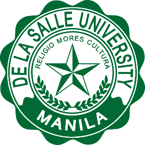

<a name="readme-top">

<br/>

<br />
<div align="center">
  <a href="https://github.com/zyx-0314/">
  <!-- TODO: If you want to add logo or banner you can add it here -->
    
  </a>
<!-- TODO: Change Title to the name of the title of your Project -->
  <h3 align="center">De La Salle University</h3>
</div>
<!-- TODO: Make a short description -->
<div align="center">
  De La Salle University (DLSU) is a premier Catholic research university in the Philippines, known for its commitment to academic excellence, innovation, and service. Established in 1911, DLSU offers a wide range of undergraduate and graduate programs across various disciplines. It is recognized for its strong emphasis on research, sustainability, and global partnerships, shaping students into future leaders dedicated to social transformation.
</div>

<br />

<!-- TODO: Change the zyx-0314 into your github username  -->
<!-- TODO: Change the WD-Template-Project into the same name of your folder -->


[](https://wakatime.com/badge/user/018dd99a-4985-4f98-8216-6ca6fe2ce0f8/project/63501637-9a31-42f0-960d-4d0ab47977f8)

---

<br />
<br />

<!-- TODO: If you want to add more layers for your readme -->
<details>
  <summary>Table of Contents</summary>
  <ol>
    <li>
      <a href="#overview">Overview</a>
      <ol>
        <li>
          <a href="#key-components">Key Components</a>
        </li>
        <li>
          <a href="#technology">Technology</a>
        </li>
      </ol>
    </li>
    <li>
      <a href="#rule,-practices-and-principles">Rules, Practices and Principles</a>
    </li>
    <li>
      <a href="#resources">Resources</a>
    </li>
  </ol>
</details>

---

## Overview

<!-- TODO: To be changed -->
<!-- The following are just sample -->
This project is a university website inspired by the De La Salle University (DLSU) website, developed using GitHub and VS Code. The purpose of this project is to create a structured and visually appealing website that provides essential information about the university, including its academic programs, admissions process, and contact details. Key components include a homepage, an about page, an admissions section, and a contact page, all designed for easy navigation and user accessibility. The website is built using HTML, CSS, and Bootstrap for responsive design, ensuring a seamless user experience across devices. GitHub is used for version control and hosting, while VS Code serves as the primary development environment.

### Key Components
<!-- TODO: List of Key Components -->
<!-- The following are just sample -->
- MultiPage Website/Single Page Website
- Parallax transition
- Transactional

### Technology
<!-- TODO: List of Technology Used -->


## Rules, Practices and Principles
1. Always use `WD-` in the front of the Title of the Project for the Subject followed by your custom naming.
2. Do not rename any .html files; always use `index.html` as the filename.
3. Place Files in their respective folders.
4. All file naming are in camel case.
   - Camel case is naming format where there is no white space in separation of each words, the first word is in all lower case while the succeding words first letter are in upper followed by lower cased letters.
   - ex.: buttonAnimatedStyle.css
5. Use only `External CSS`.
6. Renaming of Pages folder names are a must, and relates to what it is doing or data it holding.
7. File Structure to follow below.

```
WD-ProjectName
└─ assets
|   └─ css
|   |   └─ style.css
|   └─ img
|   |   └─ fileWith.jpeg/.jpg/.webp/.png
|   └─ js
|       └─ script.js
└─ pages
|  └─ pageName
|     └─ assets
|     |  └─ css
|     |  |  └─ style.css
|     |  └─ img
|     |  |  └─ fileWith.jpeg/.jpg/.webp/.png
|     |  └─ js
|     |     └─ script.js
|     └─ index.html
└─ index.html
└─ readme.md
```

## Resources

<!-- TODO: Add References -->
| Title | Purpose | Link |
|-|-|-|
| De La Salle University | The purpose of this website is to provide an informative and user-friendly platform that showcases the university’s academic offerings, admissions process, and key institutional details. It aims to enhance accessibility for prospective students, faculty, and visitors by delivering a structured and visually engaging experience. Additionally, the website serves as a digital representation of the university, promoting its values, programs, and community engagement. | dlsu.edu.ph |
